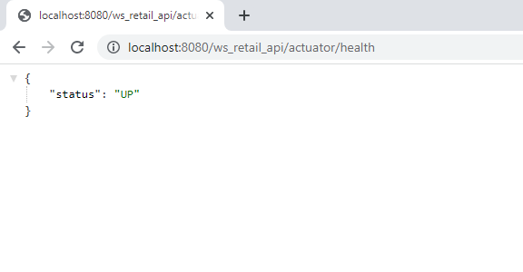

### ws_retail_api ###

This is the retail webservice to calculate reward points 

## How To Run In Docker Container ##

1. Locate a Docker File and run following command to build a tag 
```bash
docker build -t ws-retail-api:latest .
```
2. Bind port 8080 and add build tag
```bash
docker run -p 8080:8080 ws-retail-api:latest
```

## How To Run Locally As Spring Boot Application ## 

1. Through IntelliJ/STS/Eclipse import as maven, spring boot app and hit run.

## Tech specs ##
1. Java 11 (OpenJDK 11)
2. Spring boot (2.7.0)
3. Spring boot starter web (2.7.0)
4. Spring boot starter actuator (2.7.0)
5. Spring boot starter data jpa (2.7.0)
6. Springfox boot starter (3.0.0)
7. H2 (2.1.212)
8. Mapstruct (1.4.2)
9. Lombok (1.15.24)

## Useful resources links ##
### health: ### 
http://localhost:8080/ws_retail_api/actuator/health



### swagger-ui: ###
http://localhost:8080/ws_retail_api/swagger-ui/index.html

