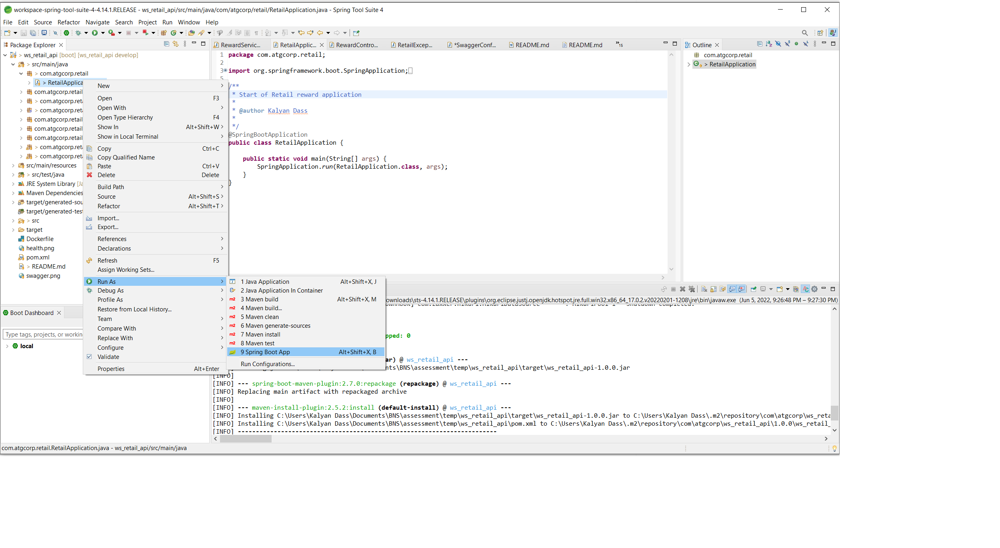
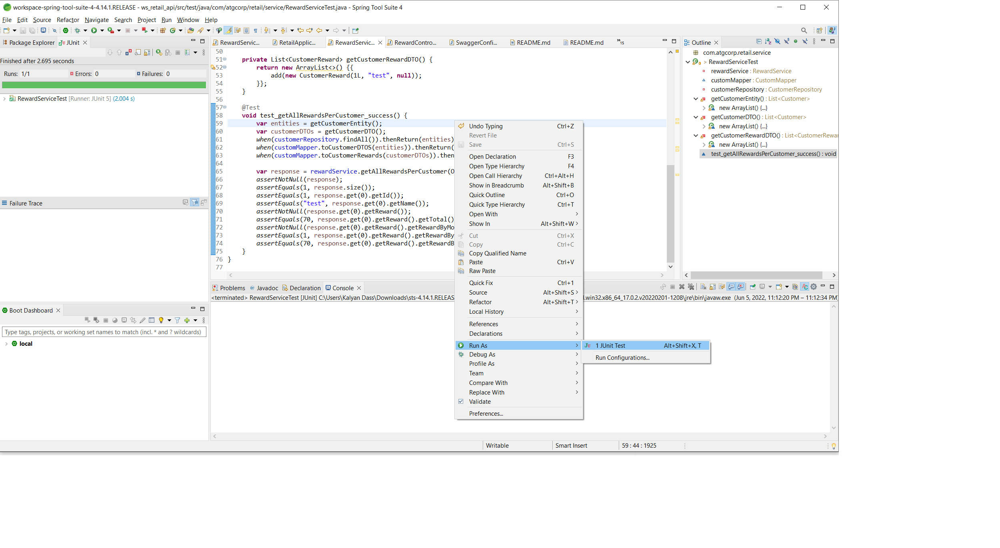
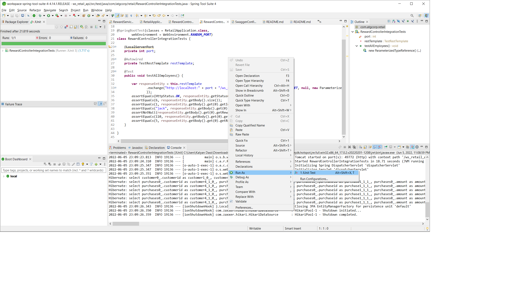
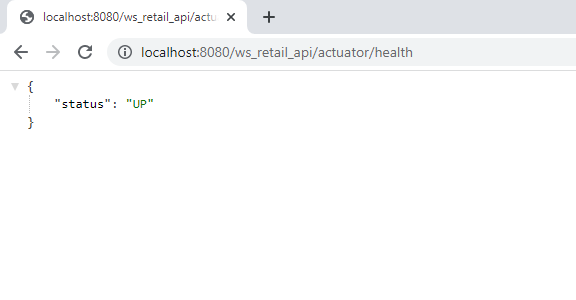
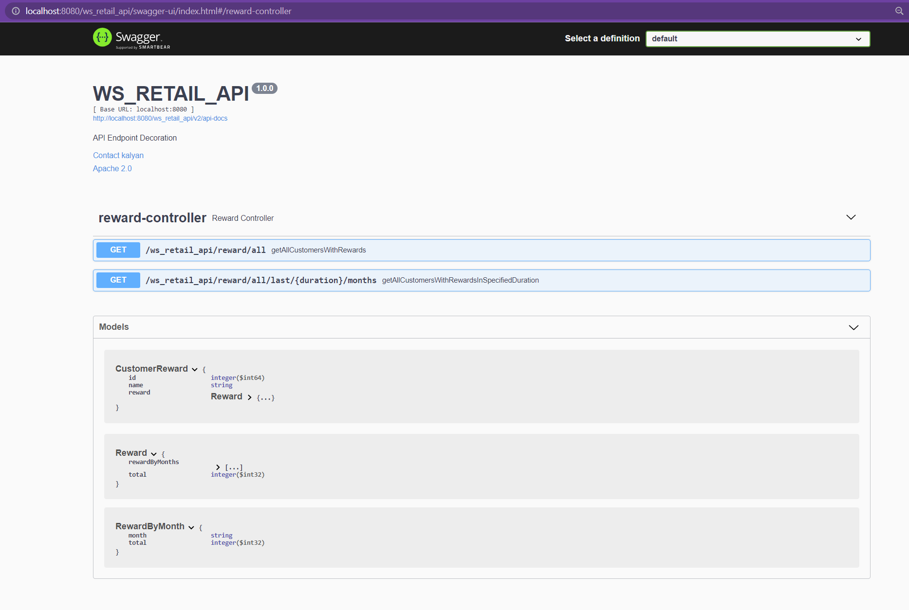
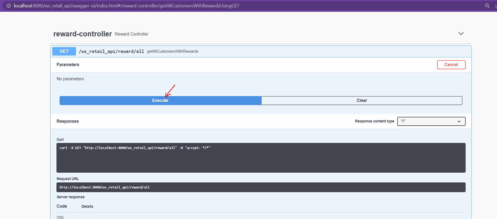
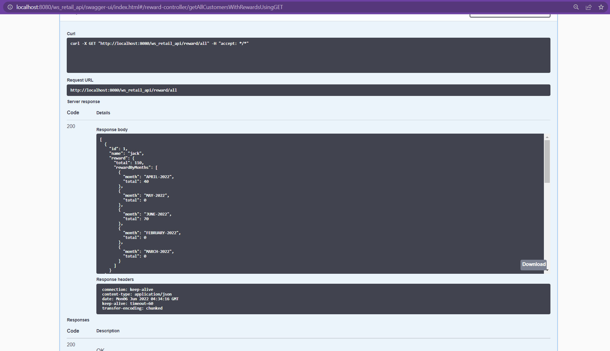
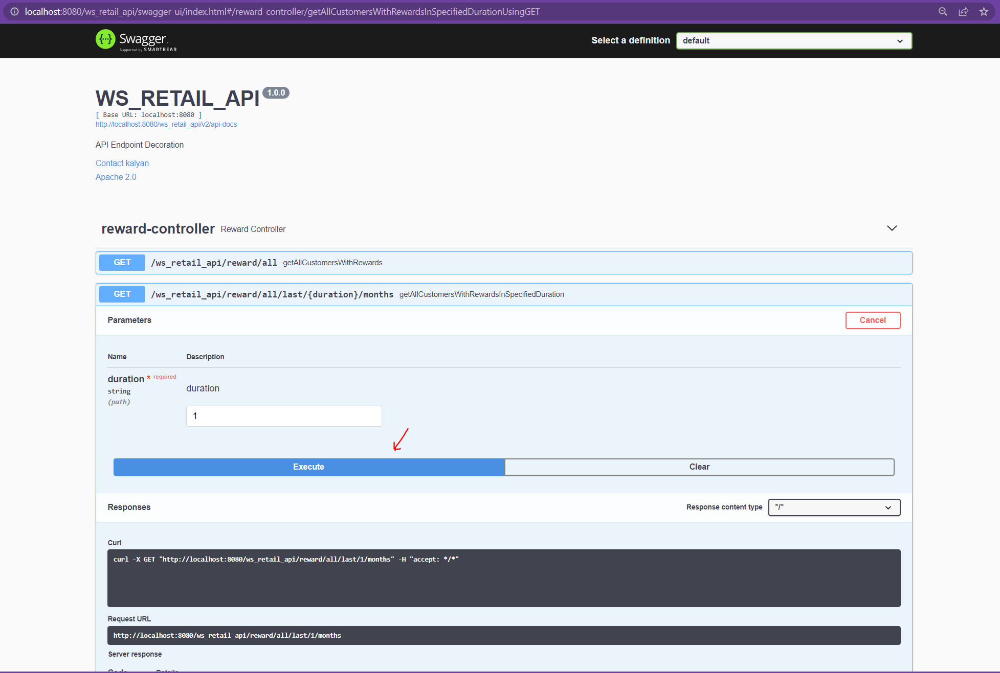
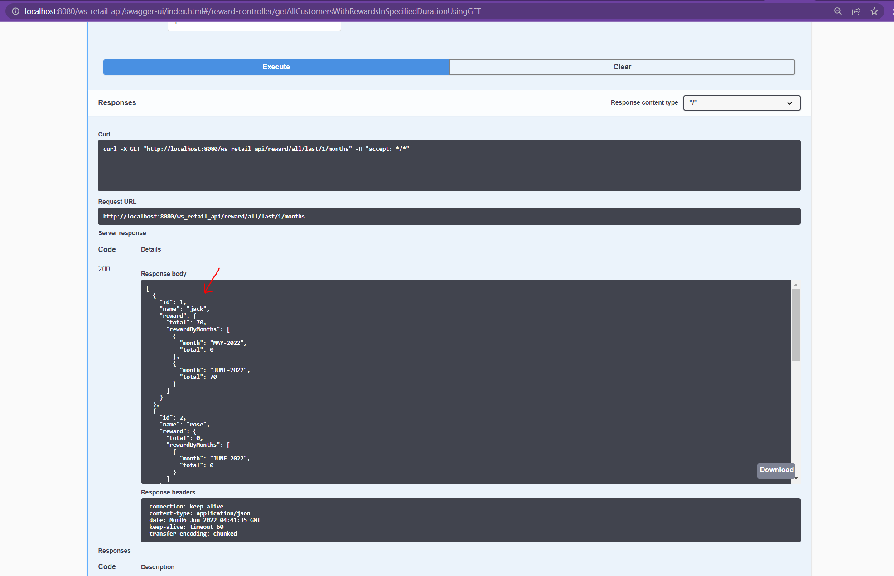

### ws_retail_api ###

This is the retail webservice to calculate reward points 

## How To Run In Docker Container ##

1. Locate a Docker File and run following command to build a tag 
```bash
docker build -t ws-retail-api:latest .
```
2. Bind port 8080 and add build tag
```bash
docker run -p 8080:8080 ws-retail-api:latest
```

## How To Run Locally As Spring Boot Application ## 

1. Through IntelliJ/STS/Eclipse import as maven, spring boot app.
2. do maven build
```bash
mvn clean install
```
3. Then run application as spring boot app.

STS - ( Go to RetailApplication class rightclick -> Run As -> click Spring boot app)



## How To Run test cases ##
1. Unit test cases ( Go to test class rightclick -> Run As -> click JUnit test)



2. Integration test cases ( Go to test class rightclick -> Run As -> click JUnit test)



## Tech specs ##
1. Java 11 (OpenJDK 11)
2. Spring boot (2.7.0)
3. Spring boot starter web (2.7.0)
4. Spring boot starter actuator (2.7.0)
5. Spring boot starter data jpa (2.7.0)
6. Springfox boot starter (3.0.0)
7. H2 (2.1.212)
8. Mapstruct (1.4.2)
9. Lombok (1.15.24)

## Useful resources links ##
### health: ### 
http://localhost:8080/ws_retail_api/actuator/health



### swagger-ui: ###
http://localhost:8080/ws_retail_api/swagger-ui/index.html




Test data:

### Customer ###
| CUSTOMERID	|		NAME	|
| :------------ | :-----------: |
| 1				| jack			|
| 2				| rose			|
| 3				| peter parker 	|
| 4				| tony stark	|
| 5				| steve rogers	|
| 6				| barry allen	|

### Purchase ###
|	PURCHASEID	|	AMOUNT	|	CUSTOMERID	|		CREATETIMESTAMP			|
| :------------ | :-------- | :------------ | :---------------------------: |
|	1			| 110		| 1				| CURRENT_TIMESTAMP - 1 DAY		|
|	2			| 10		| 1				| CURRENT_TIMESTAMP - 1 MONTH	|
|	3			| 90		| 1				| CURRENT_TIMESTAMP - 2 MONTH	|
|	4			| 40		| 1				| CURRENT_TIMESTAMP - 3 MONTH	|
|	5			| 50		| 1				| CURRENT_TIMESTAMP - 4 MONTH	|
|	6			| 10		| 2				| CURRENT_TIMESTAMP				|
|	7			| 50		| 3				| CURRENT_TIMESTAMP				|
|	8			| 90		| 5				| CURRENT_TIMESTAMP				|
|	9			| 110		| 6				| CURRENT_TIMESTAMP				|

## Test Data with expected rewards##

Customer 1: Jack
: Purchases
: transaction 1 - 110 (rewards -> (110-50)*1 + (110-100)*1 = 70)
: transaction 2 - 10 (rewards -> 0)
: transaction 3 - 90 (rewards -> (90-50)*1 = 40)
: transaction 4 - 40 (rewards -> 0)
: transaction 5 - 50 (rewards -> 0)

: Total rewards till date = 110

Customer 2: Rose
: Purchases
: transaction 1 - 10 (rewards -> 0)

: Total rewards till date = 0

Customer 3: peter parker
: Purchases
: transaction 1 - 10 (rewards -> 0)

: Total rewards till date = 0

Customer 4: tony stark
: Purchases
: No transactions

: Total rewards till date = 0

Customer 5: steve rogers
: Purchases
: transaction 1 - 90 (rewards -> (90-50)*1 = 40)

: Total rewards till date = 40

Customer 6: barry allen
: Purchases
: transaction 1 - 110 (rewards -> (110-50)*1 + (110-100)*1 = 70)

: Total rewards till date = 70

## Sample calls ##

### /reward/all ###

request:
```bash
http://localhost:8080/ws_retail_api/reward/all
```



response:
```bash
[
  {
    "id": 1,
    "name": "jack",
    "reward": {
      "total": 110,
      "rewardByMonths": [
        {
          "month": "APRIL-2022",
          "total": 40
        },
        {
          "month": "MAY-2022",
          "total": 0
        },
        {
          "month": "JUNE-2022",
          "total": 70
        },
        {
          "month": "FEBRUARY-2022",
          "total": 0
        },
        {
          "month": "MARCH-2022",
          "total": 0
        }
      ]
    }
  },
  {
    "id": 2,
    "name": "rose",
    "reward": {
      "total": 0,
      "rewardByMonths": [
        {
          "month": "JUNE-2022",
          "total": 0
        }
      ]
    }
  },
  {
    "id": 3,
    "name": "peter parker",
    "reward": {
      "total": 0,
      "rewardByMonths": [
        {
          "month": "JUNE-2022",
          "total": 0
        }
      ]
    }
  },
  {
    "id": 4,
    "name": "tony stark",
    "reward": null
  },
  {
    "id": 5,
    "name": "steve rogers",
    "reward": {
      "total": 40,
      "rewardByMonths": [
        {
          "month": "JUNE-2022",
          "total": 40
        }
      ]
    }
  },
  {
    "id": 6,
    "name": "barry allen",
    "reward": {
      "total": 70,
      "rewardByMonths": [
        {
          "month": "JUNE-2022",
          "total": 70
        }
      ]
    }
  }
]
```



### /reward/all/last/{duration}/months ###

request:
```bash
http://localhost:8080/ws_retail_api/reward/all/last/1/months
```



response:
```bash
[
  {
    "id": 1,
    "name": "jack",
    "reward": {
      "total": 70,
      "rewardByMonths": [
        {
          "month": "MAY-2022",
          "total": 0
        },
        {
          "month": "JUNE-2022",
          "total": 70
        }
      ]
    }
  },
  {
    "id": 2,
    "name": "rose",
    "reward": {
      "total": 0,
      "rewardByMonths": [
        {
          "month": "JUNE-2022",
          "total": 0
        }
      ]
    }
  },
  {
    "id": 3,
    "name": "peter parker",
    "reward": {
      "total": 0,
      "rewardByMonths": [
        {
          "month": "JUNE-2022",
          "total": 0
        }
      ]
    }
  },
  {
    "id": 4,
    "name": "tony stark",
    "reward": null
  },
  {
    "id": 5,
    "name": "steve rogers",
    "reward": {
      "total": 40,
      "rewardByMonths": [
        {
          "month": "JUNE-2022",
          "total": 40
        }
      ]
    }
  },
  {
    "id": 6,
    "name": "barry allen",
    "reward": {
      "total": 70,
      "rewardByMonths": [
        {
          "month": "JUNE-2022",
          "total": 70
        }
      ]
    }
  }
]
```
